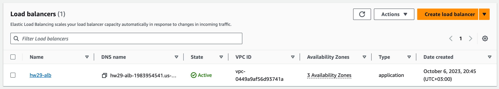

# Scale It!

1. Create autoscale group that will contain one ondemand instance and will scale on spot instances.
1. Set up scaling policy based on AVG CPU usage
1. Set up scaling policy based on requests amount that allows non-linear growth 

# Solution

For this homework terraform was used, implemented load balancer, target group, two auto scaling groups for dynamic and predictive scaling. For more information about infra see [main.tf](./main.tf).

Below are two screenshots that show LB works:

The next few screenshots show AWS ASG dynamic scaling policy

The next screenshots show AWS ASG with predictive scaling policy and different types of instance types [spot, on-demand] 

