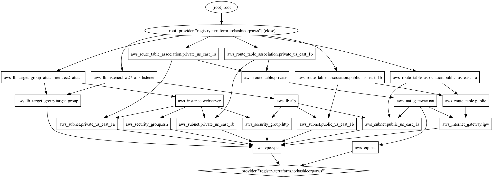
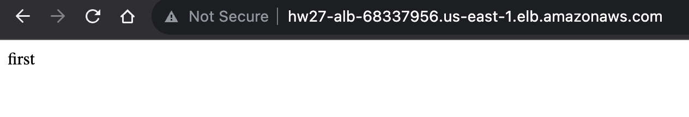
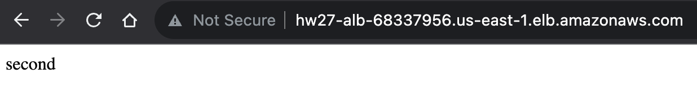
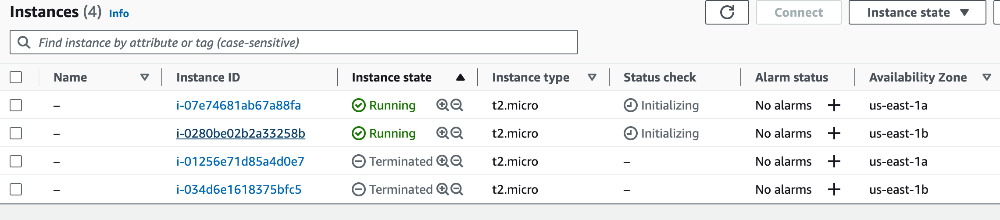
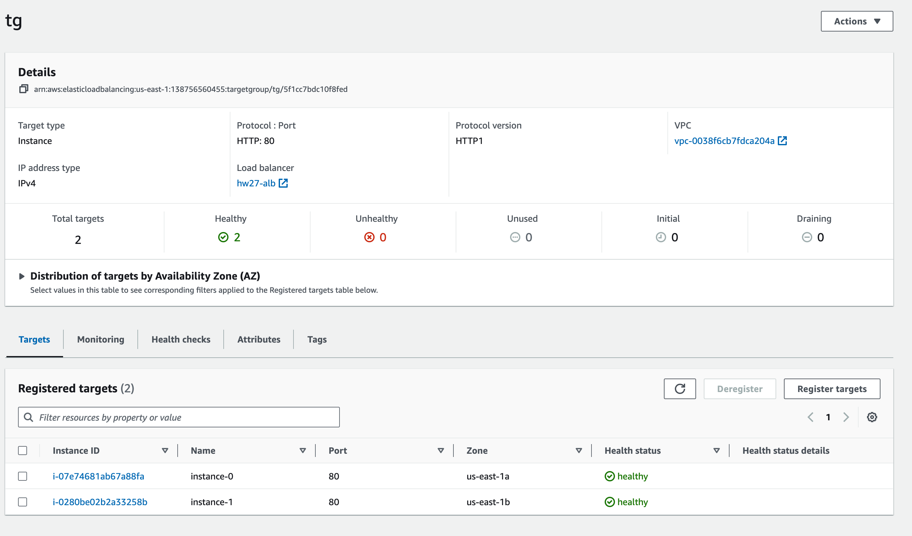
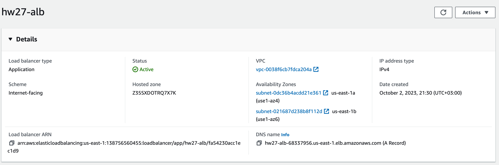

# Simple Setup

1. Create 2 micro instances in AWS
1. Setup application load balancer and assign instances to it

# Solution

For this homework terraform was used, implemented vpc, security groups for private instances, and public load balancer, two ec2 instances, target group for ec2 and alb. For more information about infra see [main.tf](./main.tf) or infra graph below.

Below are two screenshots that show LB works:

The next few screenshots show AWS Console state

