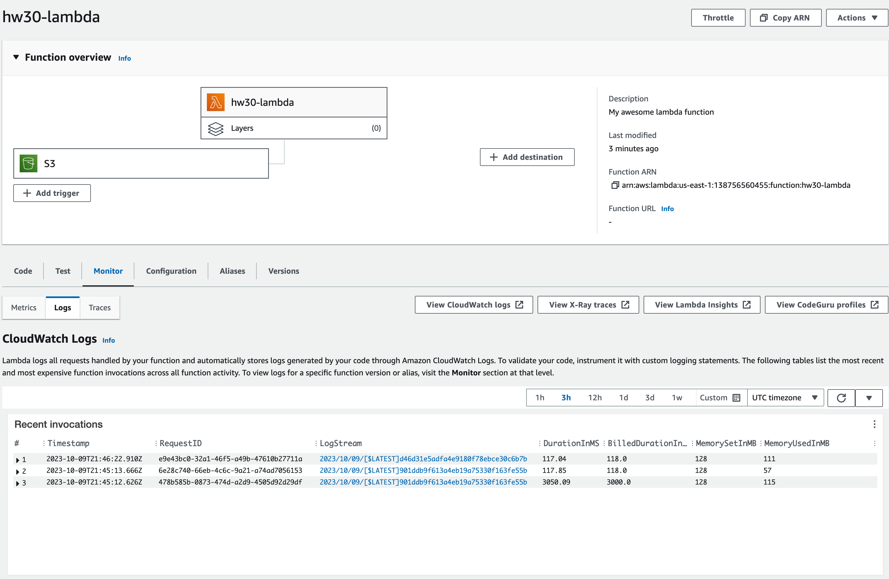
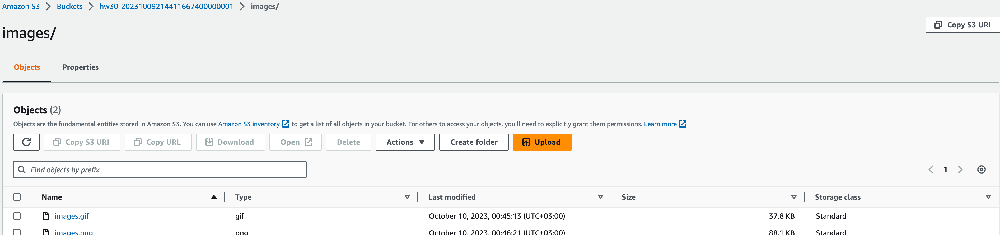

# Image Converter

1. Create Lambda function that will convert JPEG to BMP, GIF, PNG

# Solution

For this homework terraform was used, implemented lambda, s3 bucket. For more information about infra see [main.tf](./main.tf).

The next few screenshots show lambda and bucket with objects

