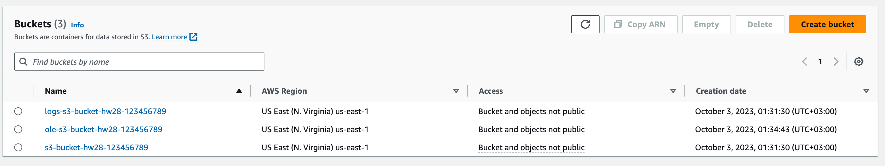
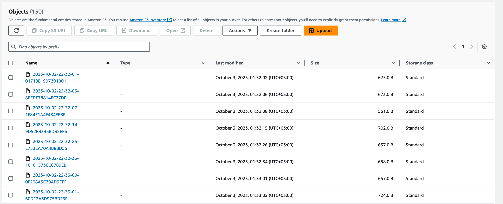
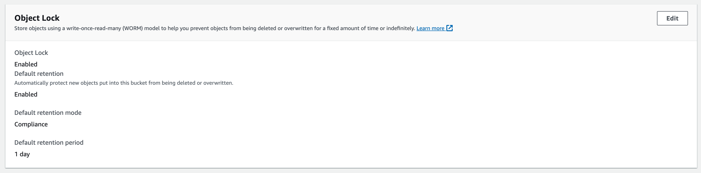
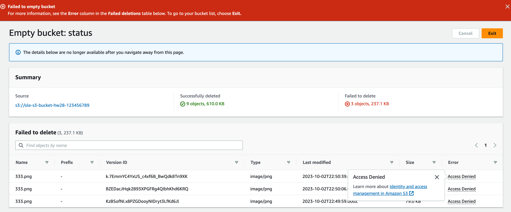

# Simple Setup

1. Create 2 micro instances in AWS
1. Setup application load balancer and assign instances to it

# Solution

For this homework terraform was used, implemented default bucket, logs bucket, and object lock bucket. For more information about infra see [main.tf](./main.tf).

The next few screenshots show buckets state

### All buckets

### Logs

### Object lock

