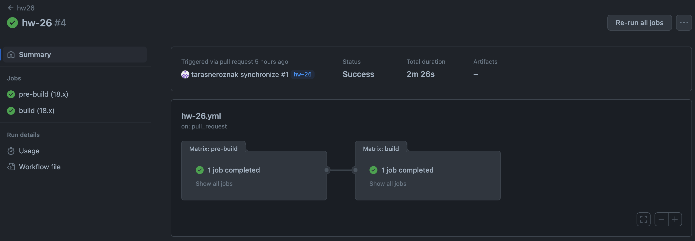

# CI/CD for Search

Setup CI/CD for your pet project or project  based on laradock

# Solution

[Github actions file](../.github/workflows/hw-26.yml)

For this homework, Gitlab actions were used, and two jobs, `pre-build` and `build`, were implemented.

`pre-build` includes:

- Linting
- Format checking
- Unit testing

The `build` job creates a Docker container and publishes it to the GitHub registry.

