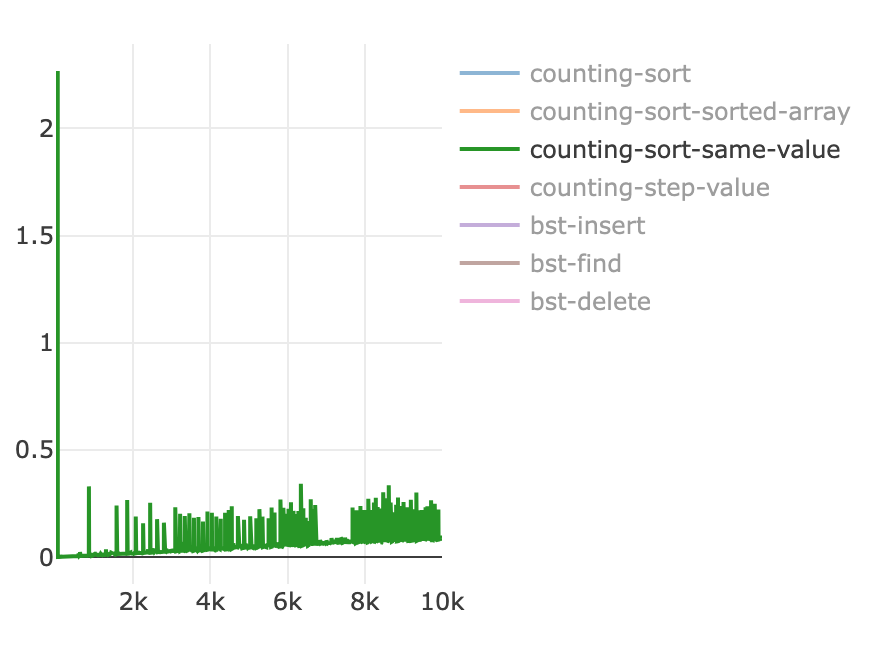

# BST and Counting Sort

1. Implement class for Balanced Binary Search Tree that can insert, find and delete elements.
1. Generate 100 random datasets and measure complexity
1. Implement Counting Sort algorithm
1. Figure out when Counting Sort doesn’t perform.

# Solution

## Counting sort

Here results for all types of samples

- random - all items are random
- sorted - random sorted values
- same - same value for all sample
- step - value is increased by step parameter

All types work fine except in case when we have huge differences between the min and max values in sample, for example, I push `4_294_967_295` number and after that get `JavaScript heap out of memory` and if decrease max element time of execution still spent a lot of time.


Below result by type

1. random


2. sorter


3. same



4. step


## BST

Here results for BST methods


### BST insert

```
count - 10000
type - random
```


### BST find

```
count - 10000
type - random
```


### BST delete

```
count - 10000
type - random
```


