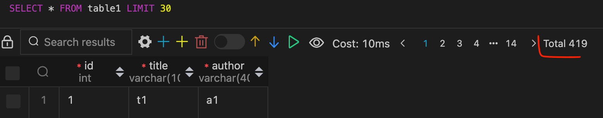
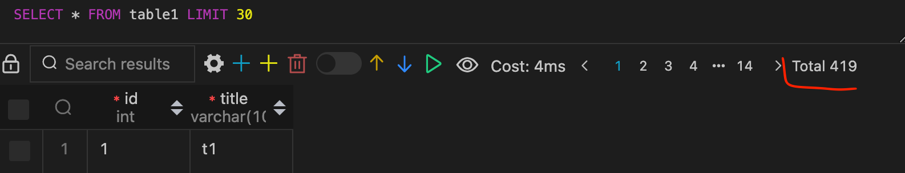
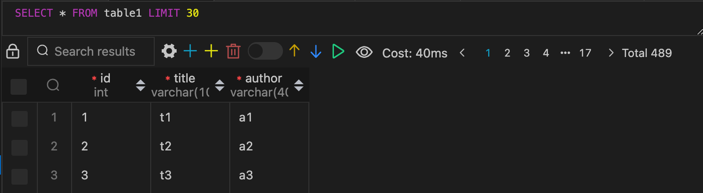
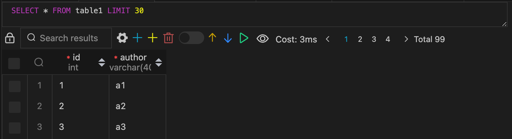

# Set up MySQL Cluster

- Create 3 docker containers: mysql-m, mysql-s1, mysql-s2
- Setup master slave replication (Master: mysql-m, Slave: mysql-s1, mysql-s2)
- Write script that will frequently write data to database
- Ensure, that replication is working
- Try to turn off mysql-s1, 
- Try to remove a column in database on slave node (try to delete last column and column from the middle)

# Solution

Config for mysql-m, mysql-s1, mysql-s2 placed in [docker-compose.yaml](./docker-compose.yaml)

Setup for master-slave replication is described in [build.sh](./build.sh), this script sets master and slave step by step.

From create user 

```
CREATE USER "mydb_slave_user"@"%" IDENTIFIED BY "mydb_slave_pwd"; GRANT REPLICATION SLAVE ON *.* TO "mydb_slave_user"@"%"; FLUSH PRIVILEGES;
```

To 

```
START SLAVE
```

Scenario for turning off `slave1` in [main.sh](./main.sh)

First insert 100 records to master table

```
QUERY="INSERT INTO $TABLE_NAME (title, author) VALUES ('\''t$INDEX'\'', '\''a$INDEX'\'')"
docker exec mysql_master sh -c "export MYSQL_PWD=111; mysql -D mydb -u root -e '$QUERY'"
```

After running disabling slave, inserting to master still working

```
QUERY="STOP SLAVE"
docker exec mysql_slave1 sh -c "export MYSQL_PWD=111; mysql -u root -e '$QUERY'"
```

After the insertion of 100 new records to the master drop the middle/last columns and enable the slave.

```
QUERY1="ALTER TABLE $TABLE_NAME DROP COLUMN title"
QUERY2="START SLAVE"
docker exec mysql_slave1 sh -c "export MYSQL_PWD=111; mysql -u root -e '$QUERY'"
```

Results for the two variants will be different when the dropped middle column slave does not work after turning it on, and when dropped the last slave works fine but does not sync the dropped column. Results are provided below.

### Last

#### master



#### slave 



### Middle

#### master



#### slave

