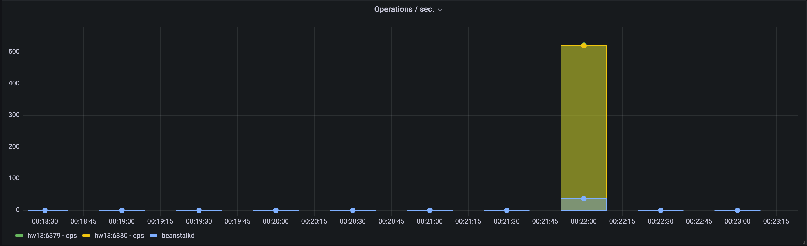
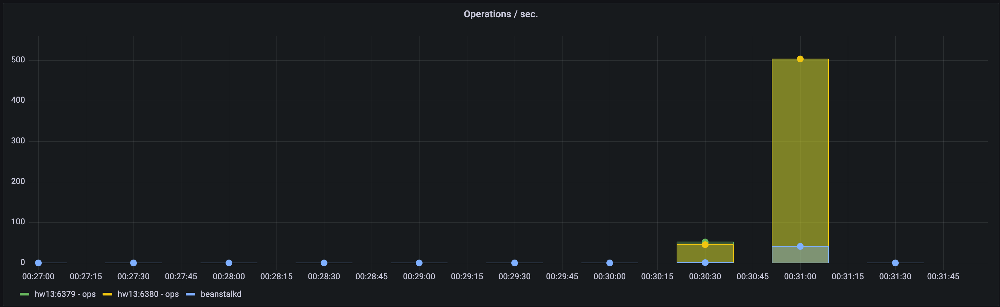
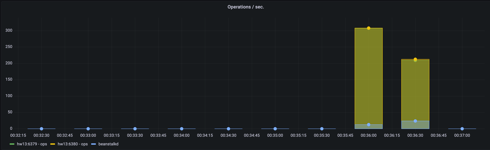
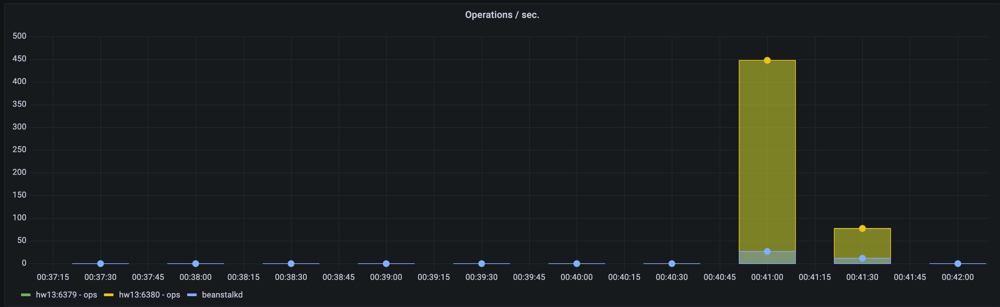

# Redis vs Beanstalkd

Set up 3 containers - beanstalkd and redis (rdb and aof)

Write 2 simple scripts: 1st should put message into queue, 2nd should read from queue.

Configure storing to disk, and compare queues performance.

# Solution

|            | -c 50  | -c 50 | -c 100 | -c 100 | -c 150 | -c 150 | -c 200 | -c 200 |
| ---------- | ------ | ----- | ------ | ------ | ------ | ------ | ------ | ------ |
|            | op/sec | cpu   | op/sec | cpu    | op/sec | cpu    | op/sec | cpu    |
| Redis RDB  | 533    | 185ms | 504    | 168ms  | 308    | 187ms  | 448    | 448    |
| Redis AOF  | 521    | 199ms | 504    | 191ms  | 308    | 161ms  | 171ms  | 141ms  |
| Beanstalkd | 38     | 5ms   | 40     | 5ms    | 24     | 4ms    | 27     | 5ms    |

### -c 50

```
$ ab -c 50 -t 30 http://127.0.0.1:8000/

Benchmarking 127.0.0.1 (be patient)
Completed 5000 requests
Completed 10000 requests
Completed 15000 requests
Finished 16273 requests
```



### -c 100

```
$ ab -c 100 -t 30 http://127.0.0.1:8000/

Benchmarking 127.0.0.1 (be patient)
Completed 5000 requests
Completed 10000 requests
Completed 15000 requests
Finished 16308 requests
```



### -c 150

```
$ ab -c 150 -t 30 http://127.0.0.1:8000/

Benchmarking 127.0.0.1 (be patient)
Completed 5000 requests
Completed 10000 requests
Completed 15000 requests
Finished 16312 requests
```



### -c 200

```
$ ab -c 200 -t 30 http://127.0.0.1:8000/

Benchmarking 127.0.0.1 (be patient)
Completed 5000 requests
Completed 10000 requests
Completed 15000 requests
Finished 16341 requests
```


