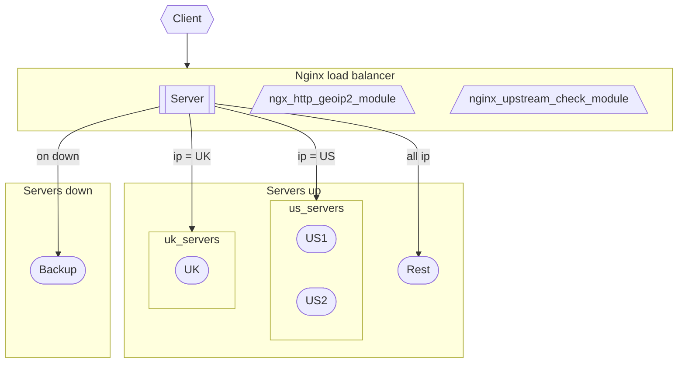
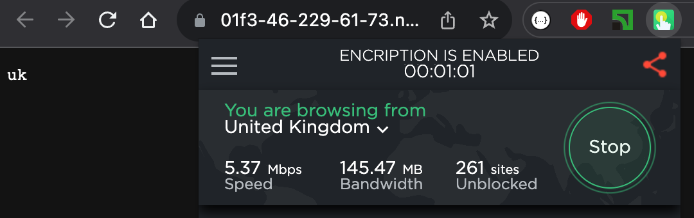
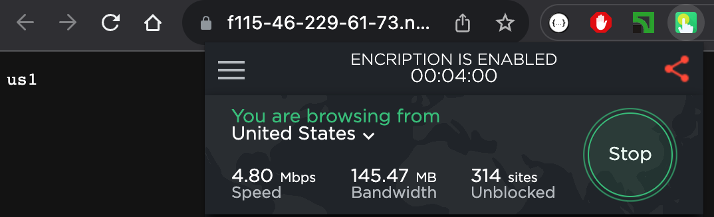
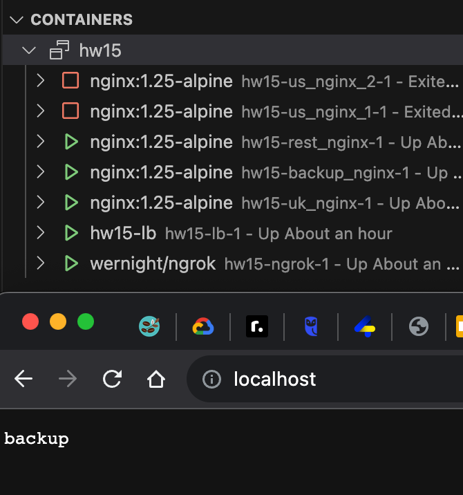

# Load Balancer

Set up load balancer on nginx that will have 1 server for UK, 2 servers for US, and 1 server for the rest.

In case of failure, it should send all traffic to backup server. Health check should happen every 5 seconds

\*Please use ngrok and touch vpn chrome extension

# Solution

### Infra

[Docker file](./docker-compose.yaml)



### GeoIp

For extract country code from ip used https://github.com/leev/ngx_http_geoip2_module module and installed to manual built nginx:

```
./configure --add-module=../ngx_http_geoip2_module-3.4
```

### Health check

Active health check belong to nginx plus so was used open source solution https://github.com/yaoweibin/nginx_upstream_check_module

```
./configure --add-module=../nginx_upstream_check_module-0.4.0
```

### Runtime

[Nginx config](./lb/nginx.conf)

How to configurated routing to uk,us,rest

```
if ($allowed_country = 1) {
    proxy_pass http://backend_uk;
}
if ($allowed_country = 2) {
    proxy_pass http://backend_us;
}
proxy_pass http://backend_rest;
```




Health check configurated for every 5s interval

```
check interval=5000 rise=1 fall=1 timeout=1000;
```


