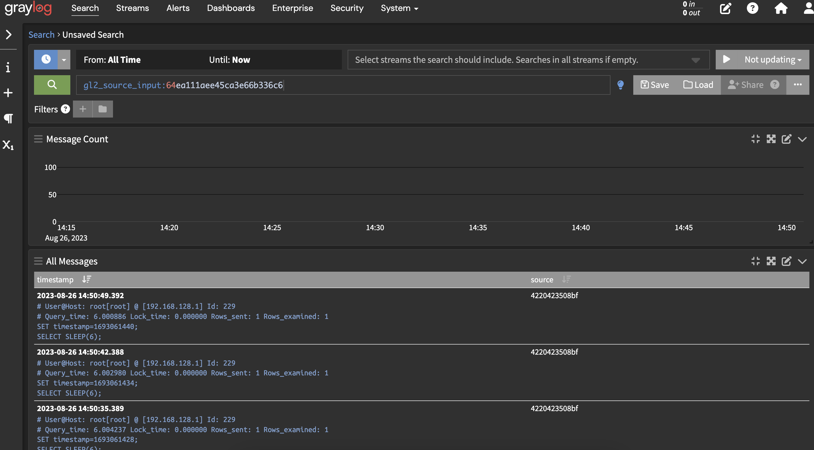
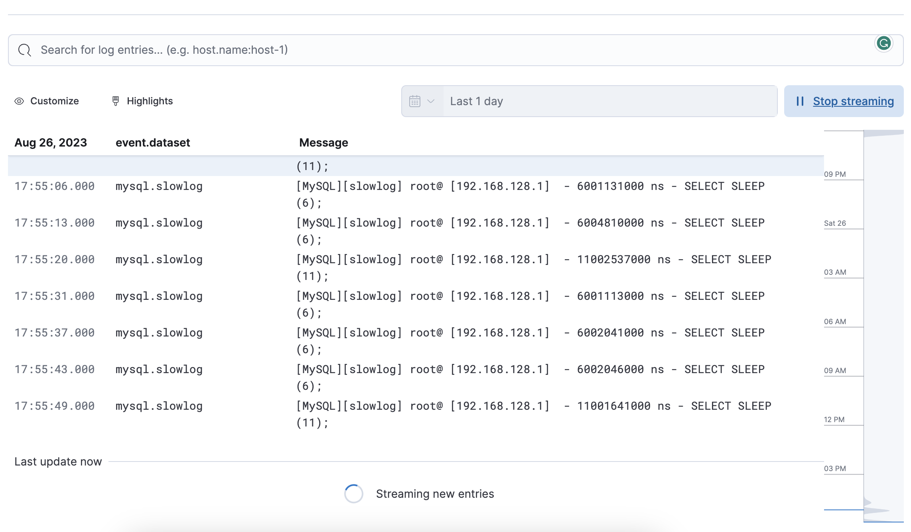
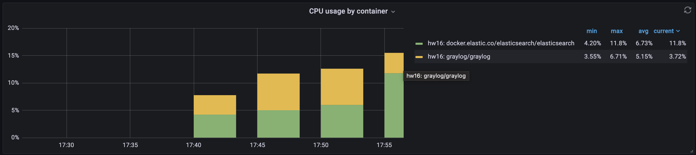
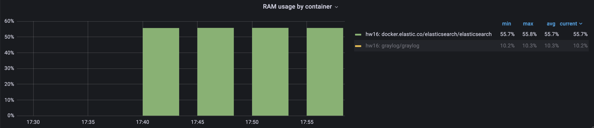
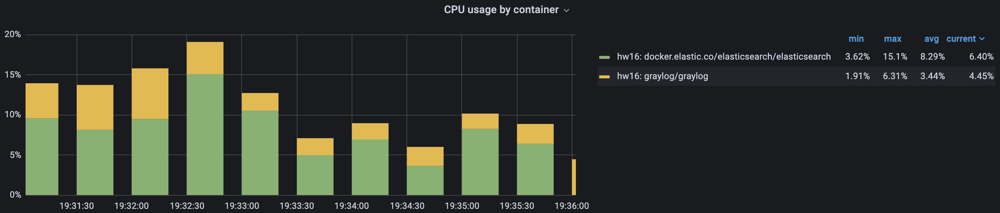
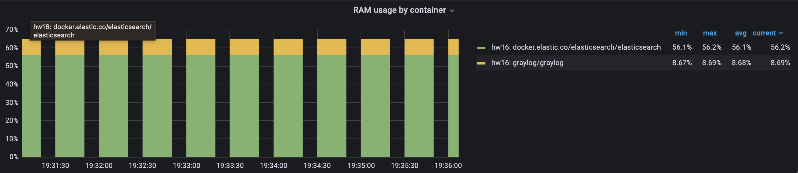
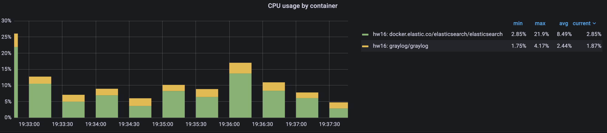
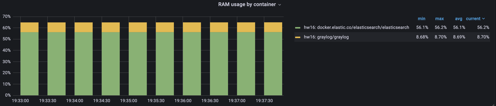

# Mysql Slow Query Log

Set up MySQL with slow query log

Configure ELK to work with mysql slow query log

Configure GrayLog2 to work with mysql slow query log

Set different thresholds for long_query_time ( 0, 1 , 10 ) and compare performance

# Solution

### long_query_time 0

### long_query_time 1

### long_query_time 10

