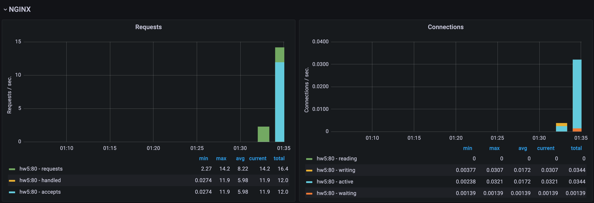
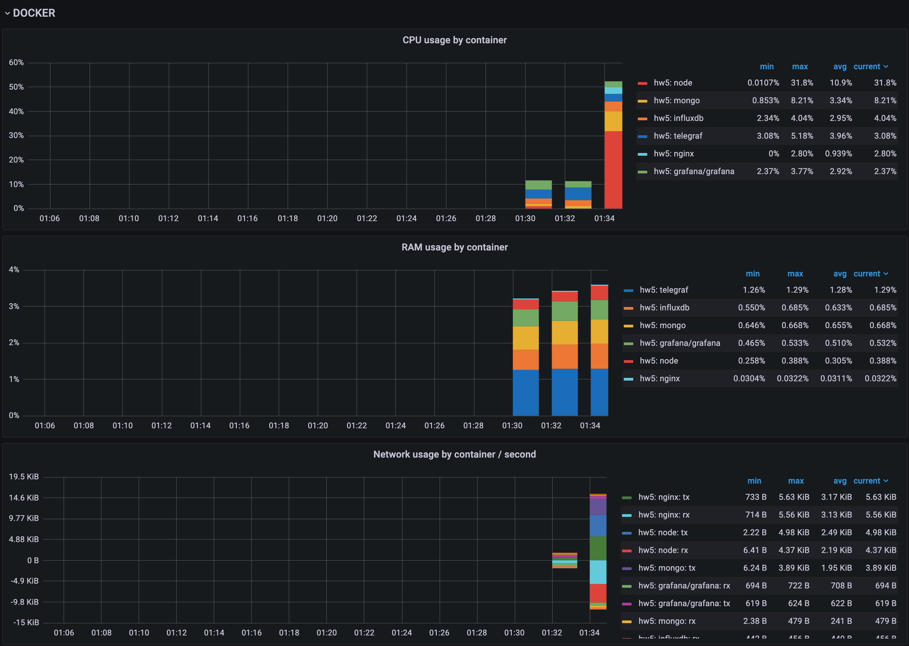
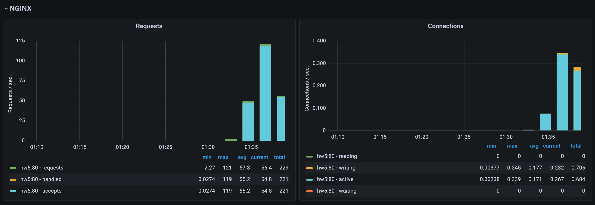
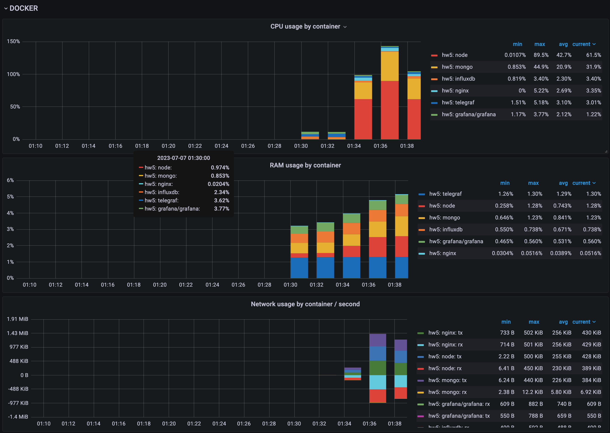

# Stress Testing. Approaches and tools

- Create simple web page that accept requests and stores data from request to database
- Prepare siege urls file
- Run siege with different concurrency ( 10, 25, 50, 100 )
- Find resource availability, avg response time, throughput

---

# Setup

1. Install `siege` - https://github.com/JoeDog/siege
1. Up infrastucture using docker

```shell
$ docker compose up -d
```

1. Generate load test file

```shell
$ node load-test-data-generator.js
```

1. Run load testing

```shell
$ . ./load-test.sh [time in seconds]
```

# Result

## Load testing with 10 concurrent users for 60 seconds

| metric                  | value  |
| ----------------------- | ------ |
| transactions            | 11776  |
| availability            | 100.00 |
| elapsed_time            | 60.79  |
| data_transferred        | 180.80 |
| response_time           | 0.05   |
| transaction_rate        | 193.72 |
| throughput              | 2.97   |
| concurrency             | 9.98   |
| successful_transactions | 11776  |
| failed_transactions     | 0      |
| longest_transaction     | 0.20   |
| shortest_transaction    | 0.00   |




## Load testing with 25 concurrent users for 60 seconds

| metric                  | value  |
| ----------------------- | ------ |
| transactions            | 6568   |
| availability            | 100.00 |
| elapsed_time            | 60.97  |
| data_transferred        | 254.65 |
| response_time           | 0.23   |
| transaction_rate        | 107.73 |
| throughput              | 4.18   |
| concurrency             | 24.94  |
| successful_transactions | 6568   |
| failed_transactions     | 0      |
| longest_transaction     | 0.87   |
| shortest_transaction    | 0.01   |

## Load testing with 50 concurrent users for 60 seconds

| metric                  | value  |
| ----------------------- | ------ |
| transactions            | 4870   |
| availability            | 100.00 |
| elapsed_time            | 60.96  |
| data_transferred        | 268.32 |
| response_time           | 0.62   |
| transaction_rate        | 79.89  |
| throughput              | 4.40   |
| concurrency             | 49.73  |
| successful_transactions | 4870   |
| failed_transactions     | 0      |
| longest_transaction     | 1.50   |
| shortest_transaction    | 0.04   |

## Load testing with 100 concurrent users for 60 seconds

| metric                  | value  |
| ----------------------- | ------ |
| transactions            | 4210   |
| availability            | 100.00 |
| elapsed_time            | 60.98  |
| data_transferred        | 279.95 |
| response_time           | 1.43   |
| transaction_rate        | 69.04  |
| throughput              | 4.59   |
| concurrency             | 98.83  |
| successful_transactions | 4210   |
| failed_transactions     | 0      |
| longest_transaction     | 3.17   |
| shortest_transaction    | 0.37   |




# Summary

| metric/concurency    | 10     | 25     | 50     | 100    | 255   |
| -------------------- | ------ | ------ | ------ | ------ | ----- |
| availability (%)     | 100.00 | 100.00 | 100.00 | 100.00 | 95.96 |
| response_time (secs) | 0.05   | 0.23   | 0.62   | 1.43   | 7.20  |
| throughput (MB/sec)  | 2.97   | 4.18   | 4.40   | 4.59   | 4.68  |
