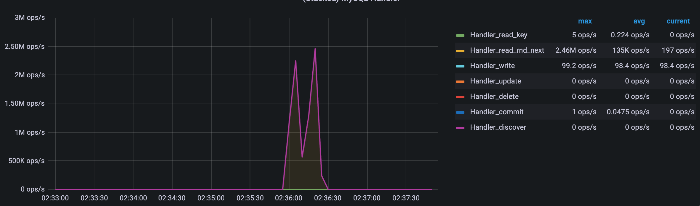
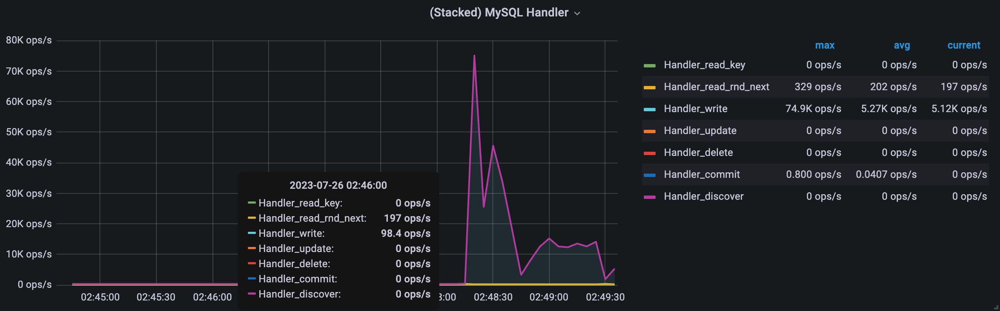
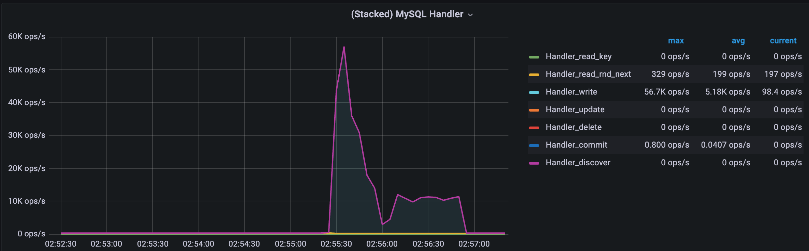
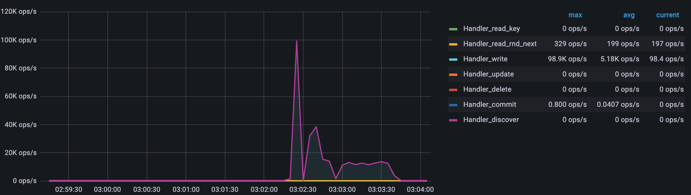

# InnoDB Indexes

MySQL with InnoDB

Make a table for 40M users

Compare performance of selections by date of birth:

- Without index
- With BTREE index
- With HASH index

Check insert speed difference with different innodb_flush_log_at_trx_commit value and different ops per second

# Solution

## Parameters

Tables

- users (InnoDB) only primary index
- users_btree (InnoDB) primary index + bithday BTREE
- users_hash (InnoDB) primary index + bithday HASH

Insert count: 500_000 rows

Rows count: > 20_000_000

Select query

```sql
SELECT * FROM users where birthday = [date]
```

Insert query

```sql
SET GLOBAL innodb_flush_log_at_trx_commit = ?;

INSERT INTO users (?);
```

## Benchmark

```
select: 23.627s
btree_select: 4.059ms
hash_select: 1.933ms
```



```
INFO: innodb_flush_log_at_trx_commit = 0

insert: 24.847s
btree_insert: 1:08.940 (m:ss.mmm)
hash_insert: 1:36.910 (m:ss.mmm)
```



```
INFO: innodb_flush_log_at_trx_commit = 1

insert: 7.009s
btree_insert: 27.164s
hash_insert: 52.885s
```



```
INFO: innodb_flush_log_at_trx_commit = 2

insert: 10.790s
btree_insert: 25.990s
hash_insert: 46.065s
```


