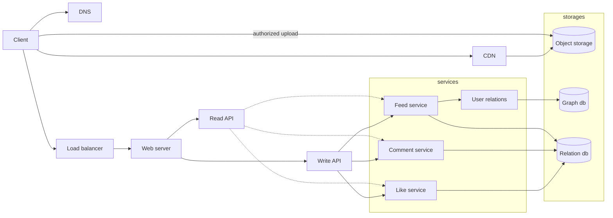
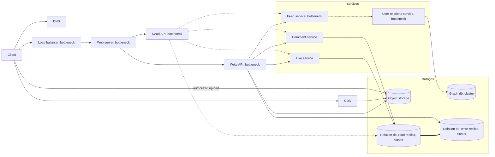

# Instagram

Choose proper architecture pattern for Instagram services

Find what will be bottleneck in each case

Find what might be a SPOF in each case

We analyse just news feed that contains video and photos. We interested only in likes and comments functionality

# Design the Instagram feed (likes, comments)

## Use cases

- User views the posts feed (suggested and following posts)
- User posts a post with a photo or with video
- User views the comments on post
- User comments the post
- User can see count of likes on post
- User likes the post

## Constraints and assumptions

- Viewing the feed should be fast (> 1 second)
- Posting a post should be fast (> 15 seconds)
- Commenting a post should be fast (> 1 second)
- Liking a post should be fast (> 1 second)

Stats from

> https://datareportal.com/essential-instagram-stats

> https://www.similarweb.com/website/instagram.com/#overview

- Monthly visits 2.336 billion
- Monthly unique visitors 217 million
- 100 million posts per day
- !!! since it is difficult to find open data. also the following values depend on many factors, so their calculation will not be exact
- ~ 500 million comments per day
- ~ 500 million likes per day

## Calculate usage

- Size per post

  - id (uuid) = 16 byte
  - user_id (uuid) = 16 byte
  - description (2200 symbols in UTF-8) ~ 2200 byte
  - image_url (max length 2048) ~ 2048 byte
  - video_url (max length 2048) ~ 2048 byte
  - total: 6.3 kb, 0.0063 mb
  - Media content (object storage)
    - image (1080x1080/1:1) < 8 mb
    - video (1080x1920/9:16) < 4 gb

- Size per comment

  - id (uuid) = 16 byte
  - user_id (uuid) = 16 byte
  - post_id (uuid) = 16 byte
  - text (2200 symbols in UTF-8) ~ 2200 byte
  - total: 2.5 kb, 0.0022 mb

- Size per like

  - id (uuid) = 16 byte
  - user_id (uuid) = 16 byte
  - post_id (uuid) = 16 byte
  - emoji (UTF-8) ~ 4 byte
  - total: 0.06 kb, 6e-5 mb

- Size of the new data per month

  - 300M posts \* 6.3kb = 1.8TB
  - 1.5B comments \* 2.5kb = 3.4883TB
  - 1.5B likes \* 0.06kb = 0.08TB
  - total: ~ 5.4TB
  - 300M media \* (8mb + 4mb) / 2 = 1718TB

- Requests
  - 2.336B reads per month, ~ 1000 per second
  - 100M posts per day, ~ 1000 per second
  - 500M comment per day, ~ 5000 per second
  - 500M likes per day, ~ 5000 per second
  - total: 12000 requests per second

## High level architecture

## SPOFs or Bottleneck

> Load balancer - YES

if the load balancer is down any requests do not start

> Web server - YES

the same like load balancer

> Write api - YES

withot write api any data creation will be blocked

> Read api - YES

withot read api user can not views post,like,comment

> Feed service - YES

if feed services are without access, the system cannot prepare personalized news

> User relations service - YES

we cannot prepare news from following users

> Comment service, like service - NO

if comment and like service are down, application can perform the main function - work with feed

## Optimized architecture

### Legent

- bottleneck - means we create more than one service
- cluster - means we create more than one service, database, etc.

