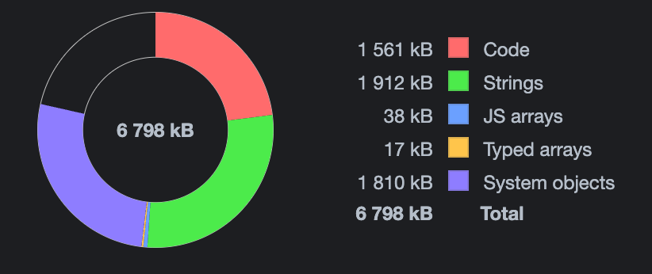
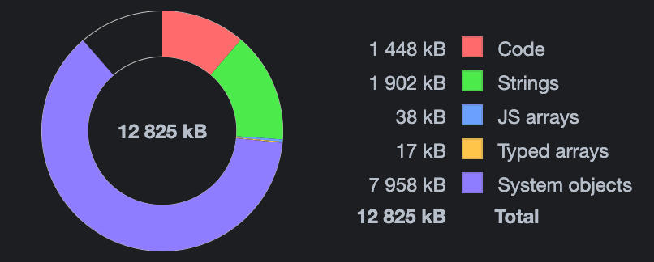
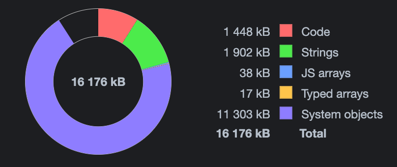

# Operation Tree Profiling

1. Implement Balanced Binary Search Tree class and operations of insert/delete/search
1. Profile space usage ( Confirm that you see O (n) )
1. Profile time consumption ( Confirm that you see O (log n))

# Solution

How to start profiler:

```bash
node --inspect profile.js
```

This solution utilized `Chrome DevTools - Inspect`, in the screenshots below, we will observe heap usage and time consumption during the execution of the BST algorithm. We began with an initial execution point involving 1000 items and added an additional 1000 items at each subsequent step.

### Space usage 

The following three screenshots display heap snapshots for 100,000, 200,000, and 300,000 items. Here, we can observe a linear dependency, as it requires 6MB for 100,000 items and 12MB for 200,000 items.







### Time consumption

In the next screenshot, we can clearly observe a logarithmic dependency. As we increase the number of items, the time required decreases.

