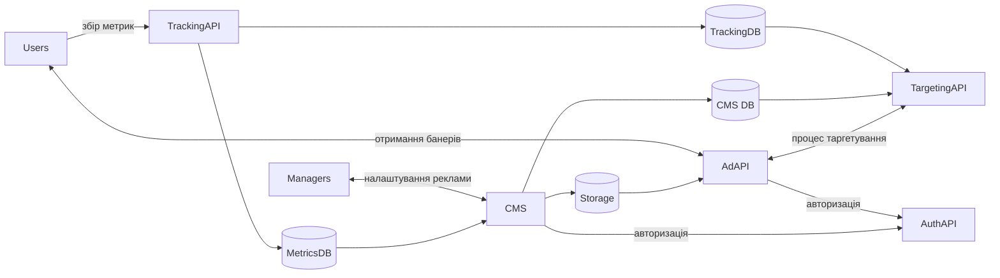

### Уявіть, що вас попросили створити систему показу реклами (спрощений клон Google AdSense) для ринку UK:

> опишіть високорівневу архітектуру проекту.

> виділіть ключові компоненти / мікро сервіси.

1. AuthAPI - сервіс авторизації аутентифікації
1. AdAPI - сервіс для обробки запитів від веб сайтів, видача рекламних банерів.
1. CMS - сервіс керування рекламним контентом
1. TargetingAPI - система тарнетину для користувачів
1. TrackingAPI - коллектор метрик

> оцініть RPS якщо ваші банери будуть на розміщені на top 10 сайтах в UK (по одному банеру на сторінку).

Данні по кількості відвідувачів взяті з ресурсу https://www.semrush.com/website/top/united-kingdom/all/

Загальна кількість відвідувачів за місяць = 8689161099, вираховуємо кількість за секунду

8689161099 / 30 / 24 / 60 / 60 = 3352 rps

З урахування змін навантаження повинна бути можливість збільшувати пропускну можливість тому система повинна обробляти 5000 RPS

> як ви організуєте систему таргетингу реклами?

Збір даних про користувачів, які відвідують сайти:

- географічні данні
- демографічні
- інтереси та поведінка
- контекстні данні

На основі данних побудувати модель машинного навчання, потім за допомогою моделі таргетувати рекламу для користувачів.

> які технології запропонуєте?

- ReactJS
- Terraform
- Python
- XGBoost
- PostgreSQL
- InfluxDB

> як будете трекати статистику?

Зберігати інформацію переглядів за допомогою скрипту який встановлюються на сторінку з рекламою.

Зберігати кількості переходів по рекламі, коли користувач натискає на рекламний банер, система може відстежувати цю дію також за домогою попередньо встановлених скриптів.

Відстеження конверсії можна реалізувати за допомогою URL-адрес з додатковими параметрами

Можна скаристатись існуючми рішеннями на кшталт Google Analytics.

> де будете зберігати статистику за показами / клікам?

Для швидкого читання/запису в Time series database, на вибір між існуючими рішеннями OpenTSDB або InfluxDB.

> оцініть орієнтовний Total Cost of Ownership.

- Розробка. Команда розробників різних спеціальностей від backend до ML інженерів, складно назвати точні значення, тому результат буде дуже примітивним - 1000000
- Інфраструктура. 5 віртуальних машин по два енвайромента (stagin, prod), теж саме і для баз данних - 2000
- Підтримка. Виправлення помилок, вдосконалення функцій, оновлення і т.д. Це включає зарплати та витрати на додаткову інфраструктуру. 50000/рік
