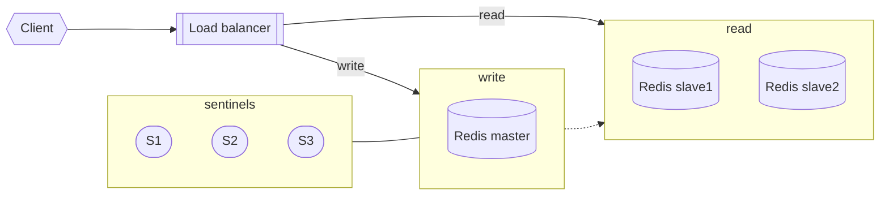

# Redis Cluster

Build master-slave redis cluster

Try all eviction strategies

Write a wrapper for Redis Client that implement probabilistic cache clearing

# Solution

### Build master-slave redis cluster

[Docker file](./docker-compose.yaml)



### Try all eviction strategies

[script](./scripts/all-evictions.js)

#### allkeys-lru

Keeps most recently used keys; removes least recently used (LRU) keys

```
1. set 'maxmemory-policy' to 'allkeys-lru'
2. get all keys with ttl
[
  [ '5bf8aeb2-4607-4484-a421-c0d96ee3885a', 60 ],
  [ '3c47e3df-d0cb-413c-aa4f-3a3b604e85cc', 60 ] -- will evicted
]
3. read 10 times first key
4. read 5 times second key
5. write new key
6. get all keys with ttl
[
  [ '5bf8aeb2-4607-4484-a421-c0d96ee3885a', 60 ],
  [ 'd2f816a6-c717-488e-8719-0961c5c0f944', 60 ]
]
```

Here we can see first key was read 4 times, so it is LRU key and it was stood in cache.

> !!! In the next examples, 1,3,4,5 will be repeated, so I describe only 2,6 and the result of the eviction

#### allkeys-lfu

Keeps frequently used keys; removes least frequently used (LFU) keys

```
...
2.
[
  [ '86faadd8-92a1-425b-9f7c-e215ad31f529', 60 ],
  [ '0e2d8584-ec1b-4b3a-995d-383c2fa9cb04', 60 ] -- evicted
]
...
6.
[
  [ '81c0c58c-77ad-4317-b58d-d3e4b7d68fd4', 60 ],
  [ '86faadd8-92a1-425b-9f7c-e215ad31f529', 60 ]
]
```

Here quite same situation like LRU, redis evict LFU keys.

#### volatile-lru

Removes least recently used keys with the expire field set to true.

```
...
2.
[
  [ '9041eb89-de13-4ddd-ba0d-924b3bba0c4e', 26 ],
  [ '8829152e-06cd-4501-97ba-2db1c3391bc6', 37 ] -- evicted
]
...
6.
[
  [ '88000b07-00f4-4e95-8e1a-844dc8615677', 12 ],
  [ '9041eb89-de13-4ddd-ba0d-924b3bba0c4e', 26 ]
]
```

Same like 'allkeys-lru', only need set 'expire'

#### volatile-lfu

Removes least frequently used keys with the expire field set to true.

```
...
2.
[
  [ 'ed2748e0-cde0-4403-bd37-aeffe7fcca02', 15 ],
  [ '2e5685b3-ee85-4e32-ac67-e13bbf870831', 31 ]
]
...
6.
[
  [ '2e5685b3-ee85-4e32-ac67-e13bbf870831', 31 ],
  [ 'dc585386-609c-47fd-9b65-fdfc11bfff73', 18 ]
]
```

Same like 'allkeys-lfu', only need set 'expire'. In this case evicted not the first key, because the last 5 read requests go to second key


#### allkeys-random

Randomly removes keys to make space for the new data added.

```
...
2.
[
  [ '466ce3c9-47e5-48df-abcb-b7b0005be8bf', -1 ],
  [ '9eb682d2-188a-4df4-99cc-fae11255a6dd', -1 ]
]
...
6.
[
  [ '700fb1f4-0826-47a7-ac7a-fbb552e64646', -1 ],
  [ '9eb682d2-188a-4df4-99cc-fae11255a6dd', -1 ]
]
```

Random case does not have pattern, so for each run evicted random key

#### volatile-random

Randomly removes keys with expire field set to true.

```
...
2.
[
  [ '4abae04c-57c3-4590-aaf7-cd436dd86b4f', 57 ],
  [ '6aa71b67-d8a5-4e07-8b1d-6452468a7433', 57 ]
]
...
6.
[
  [ '4abae04c-57c3-4590-aaf7-cd436dd86b4f', 57 ],
  [ '7f12733d-4f3f-4a3e-bcab-c4b3247a97b3', 57 ]
]
```

Same for the previous case, only expiration must be set

#### volatile-ttl

Removes keys with expire field set to true and the shortest remaining time-to-live (TTL) value.

```
...
2.
[
  [ '7ef395f3-de12-47d6-ac87-113970b332e1', 29 ], - ecited
  [ '1d0f6b13-dcfc-4936-8600-a0f9f0b24951', 29 ]
]
...
6.
[
  [ '1d0f6b13-dcfc-4936-8600-a0f9f0b24951', 29 ],
  [ 'a404807d-e703-4de1-8fab-a0a33df63bdc', 29 ]
]
```

In this case, redis evicted the first key, because must be expired first

#### noeviction

Got error

```
ErrorReply: OOM command not allowed when used memory > 'maxmemory'.
```

### Probabilistic cache

[script](./scripts/probabilistic-read.js)

Output example

```
-- Write key with TTL for key is 13, start 'read'
cache hit 13
cache hit 12
cache hit 11
cache hit 10
-- (time - delta * beta * random) >= expiry : the condition is fulfilled, we lock the key and overwrite the value with a new ttl
cache miss - read from db { time: 1691933695, ttl: 9, expiry: 1691933704 }
-- next two rows have same value, because previous lock return the cached value
cache hit 9
cache hit 9
cache hit 8
cache hit 7
cache hit 6
cache miss - read from db { time: 1691933703, ttl: 5, expiry: 1691933708 }
cache hit 5
cache hit 9
cache hit 8
cache miss - read from db { time: 1691933708, ttl: 7, expiry: 1691933715 }
cache hit 7
```

What can be tuned: 

1. beta - I did not tune this value, because for example mean value it is ok. But for real worls need to set best value from 0 to 1.
1. delta - Same for this parameter, I set 2 seconds only for example, for the real project needs to set value based on response time measurements.