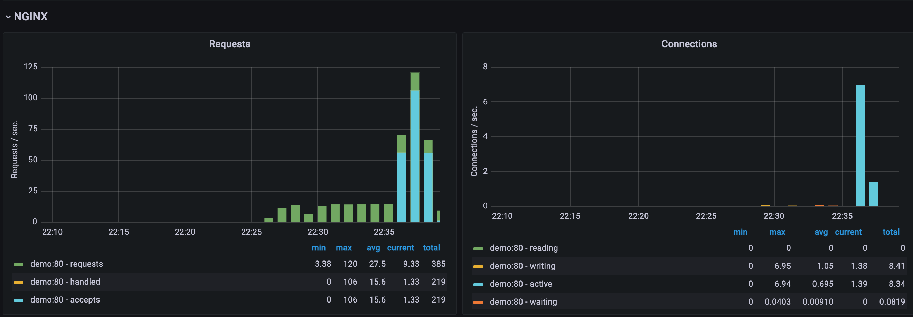

# Resource monitoring systems

Використовуючи TIG стек, підготуйте моніторинг для:

- mongodb
- elasticsearch
- php-fpm / nodejs /або контейнер для мови програмування на ваш вибір
- nginx

При виконанні запита nginx має прокидувати запит на application контейнер (на діаграмі це PHP-FPM, але може бути будь який на ваш вибір) а той в свою чергу має надсилати запити на mongo та elasticsearch.

За допомогою ab або siege згенеруйте навантаження на вашу систему та переконайтеся що моніторинг коректно відображає навантаження

Результат має бути оформлений у вигляді публічного репозиторію у якому за допомогою docker-compose описана архітекрура що зображена на діаграмі. Також в цьому репозиторії має бути скрипт для генерації навантаження та скріншоти дашбордів під час навантаження

---

# Result

!!! Problem

It was not possible to connect the import of metrics from mongodb, with all tested configurations I receive:

```
2023-07-02T19:54:25Z W! [inputs.mongodb] Collection took longer than expected; not complete after interval of 5s
2023-07-02T19:54:25Z E! [inputs.mongodb] Error in plugin: unable to connect to MongoDB: no reachable servers
```

---

- [Architecture](./docker-compose.yaml)
- [Sccript](./load_test.sh)
- [Screenshots](./assets)


### Load test

```shell
$ docker compose up -d
$ ab -c 500 -t 120 127.0.0.1/api

This is ApacheBench, Version 2.3 <$Revision: 1903618 $>
Copyright 1996 Adam Twiss, Zeus Technology Ltd, http://www.zeustech.net/
Licensed to The Apache Software Foundation, http://www.apache.org/

Benchmarking 127.0.0.1 (be patient)
Completed 5000 requests
Completed 10000 requests
Finished 12425 requests


Server Software:        nginx/1.25.1
Server Hostname:        127.0.0.1
Server Port:            80

Document Path:          /api
Document Length:        118 bytes

Concurrency Level:      500
Time taken for tests:   120.022 seconds
Complete requests:      12425
Failed requests:        12418
   (Connect: 0, Receive: 0, Length: 12418, Exceptions: 0)
Total transferred:      225659088 bytes
HTML transferred:       224055876 bytes
Requests per second:    103.52 [#/sec] (mean)
Time per request:       4829.856 [ms] (mean)
Time per request:       9.660 [ms] (mean, across all concurrent requests)
Transfer rate:          1836.08 [Kbytes/sec] received

Connection Times (ms)
              min  mean[+/-sd] median   max
Connect:        0    5  32.1      0     404
Processing:    78 4712 1191.0   4829    7540
Waiting:       62 4700 1190.7   4817    7533
Total:         79 4717 1182.0   4830    7540

Percentage of the requests served within a certain time (ms)
  50%   4829
  66%   5243
  75%   5566
  80%   5701
  90%   6109
  95%   6586
  98%   6823
  99%   6984
 100%   7540 (longest request)
```


### Nginx



### Elastic


### Docker


